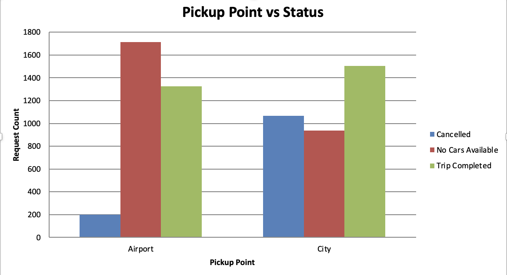
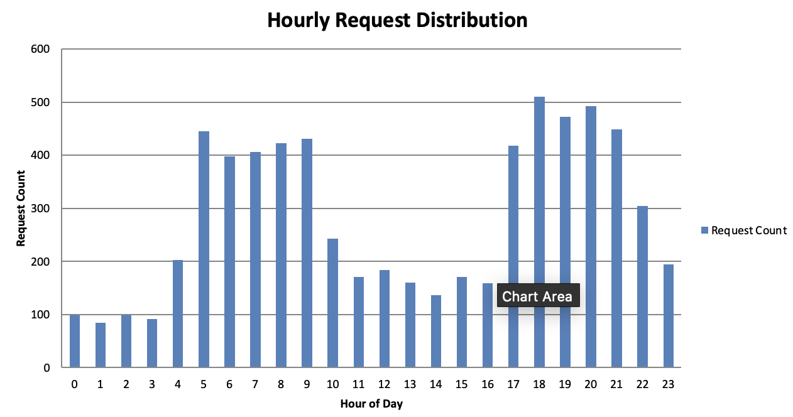
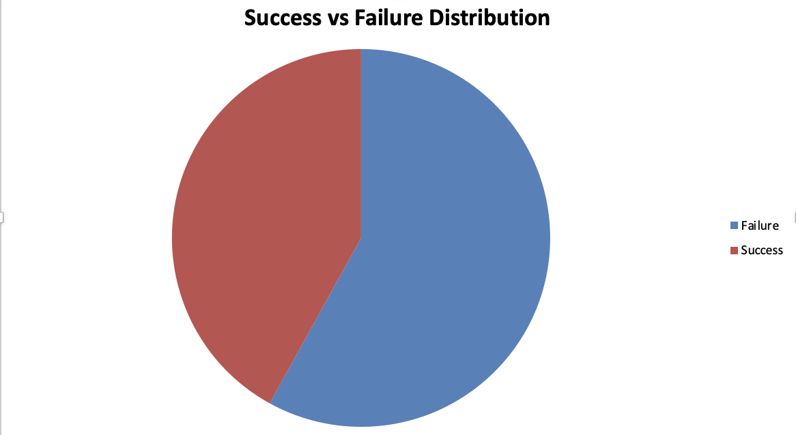

# Uber Supply-Demand Gap Analysis

## Table of Contents

* [Project Overview](#project-overview)
* [Data Cleaning and Preparation](#data-cleaning-and-preparation)
* [Excel Dashboard Summary](#excel-dashboard-summary)
* [SQL Insights](#sql-insights)
* [Python EDA Insights](#python-eda-insights)
* [Data Sources](#data-sources)
* [Recommendations](#recommendations)

## Project Overview

This project investigates the Uber supply-demand gap using the data. Through a
combination of Excel dashboards, SQL queries, and Python-based EDA, we identify periods
of high demand and frequent trip failures. Our goal is to uncover patterns that explain user
dissatisfaction, driver availability, and canceled rides, and provide actionable insights.

## Data Cleaning and Preparation

The dataset was cleaned using Excel and Python Pandas.

Key steps:
- Converted inconsistent timestamp formats to datetime.
- Extracted date, hour, and weekday from request timestamps.
- Classified requests into time slots: Early Morning, Morning, Afternoon, Evening, Night.
- Calculated Trip Duration (only for completed rides).
- Created Status Category column to label trips as Success or Failure.
- Handled missing values in Drop timestamp by interpreting them as failed rides.

## Excel Dashboard Summary

### Chart 1: Status by Time Slot

This chart compares the count of each ride status across time slots. It highlights that most
trip failures (No Cars Available and Cancelled) occur in the Early Morning and Night. This
insight informs when driver supply needs to be increased.

### Chart 2: Pickup Point by Status

This chart shows how ride statuses vary across pickup points (Airport and City). City
pickups face more cancellations, while Airport pickups are often met with no availability —
especially at night.

### Chart 3: Hourly Request Distribution

Displays ride request volume across 24 hours. Clear spikes are observed between 5–9 AM
and 5–8 PM, suggesting peak periods where Uber should increase supply or apply surge
pricing.

### Chart 4: Success Vs Failure

Shows the overall trip completion ratio. Only 39.6% of total requests are fulfilled,
emphasizing the urgent need to optimize driver availability and reduce cancellations.

